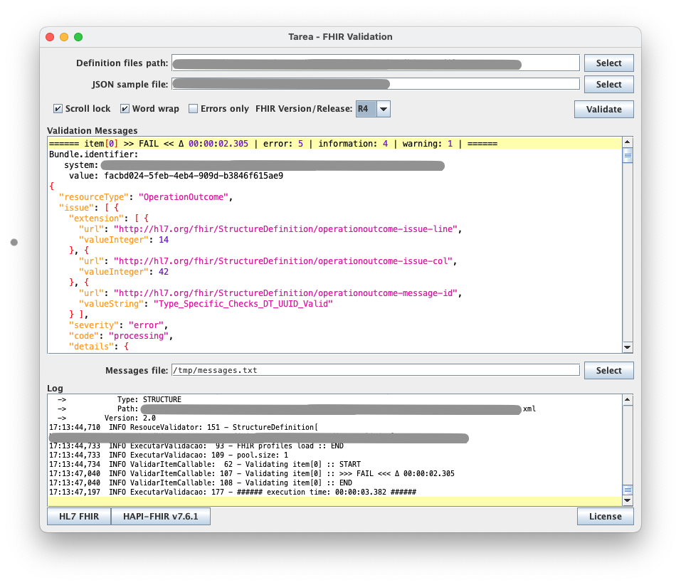

# Tarea FHIR Validator UI

A Java (JDK 21) Swing GUI for verifying if a [HL7 FHIR](https://www.hl7.org/fhir/) JSON file is correct according to a set of [profile definitions](https://www.hl7.org/fhir/profiling.html).

## A bit of the "why" this was built

In the second half of 2019 the Ministry of Health of Brazil started the [RNDS](https://www.gov.br/saude/pt-br/composicao/seidigi/rnds) and one of the requirements was to use [HL7 FHIR](https://www.hl7.org/fhir/).

One of the goals was evolve, or "move", from CDA, IHE, PIX and PDQ to a standard more friendlier to mobile and technologies like [SPA](https://developer.mozilla.org/en-US/docs/Glossary/SPA) (remember it was on the second half of 2019).

So when compared _pros_ and _cons_ whe choosed the [HAPI-FHIR](https://hapifhir.io/) framework and the work to implement a HL7 v4 compliant server stated. In parallel other team was working on how to create the RNDS FHIR ["profile"](https://www.hl7.org/fhir/profiling.html), they choose to use [Forge](https://simplifier.net/forge) from [Simplifier.net](Simplifier.net) as profiling tool.

It's important to note that the dev and the profiling teams had agreed, backed by the project stakeholders, that the FHIR profile had to be supported by the HAPI-FHIR framework.

This tool was created to help the profile team to make a FHIR profile that was fully supported by the HAPI-FHIR framework leveling up the field with the dev team.

## Implementation

This project use:

* [HAPI-FHIR](https://hapifhir.io/), v7.6.1
* [JDK](https://www.oracle.com/br/java/technologies/downloads/) 21
* [Gradle](https://gradle.org/)

I used Eclipse IDE and the UI was built using [WindowBuilder](https://eclipse.dev/windowbuilder/) plugin.

## HAPI-FHIR Validation

If you found this repo searching for a way to load your own profiles for [HAPI-FHIR validate](https://hapifhir.io/hapi-fhir/docs/validation/examples.html), look a this files:

* [ResourcesLoader.java](src/main/java/br/com/tarea/fhir/val/rsc/ResourcesLoader.java)
    * Load, recursively, the profiles file (XML or JSON) from a local folder keeping.

* [ResouceValidator.java](src/main/java/br/com/tarea/fhir/val/rsc/ResouceValidator.java)
    * Configure the ```ca.uhn.fhir.validation.FhirValidator```.


## The UI

Here how the UI look like:



* ```Definition files path```, can be emtpy.
* ```JSON sample file```, must be selected.
* ```FHIR Version/Release```, to choose beetwen R4, R4B and R5 FHIR versions.

To execute the validation clique on ```Validate``` button.

The result of the validation is showed on ```Validation Messages```.

The ```Log``` panel uses Log4J.

The JSON sample file can be a array, the application will attempt to validate each array item.

Whe you close the UI, it will write the file ```${user.home}/FhirValidacaoWindow.cfg``` whe the last size, screen position and the current form values.

The buttons on the bottom open the HL7 FHIR, HAPI-FHIR pages.

The ```License``` button show the Apache Licence version 2.0 disclaimer.

## Using

Make sure you have the latest [JDK or JRE](https://www.oracle.com/br/java/technologies/downloads/) installed and configured, download the latest [release](releases).

On Windows:

```bat
executar.bat
```

On Linux/MacOS:

```sh
./executar.sh
```

And you can run from source code using Gradle:

```sh
gradle run
```

## Conclusion

This tool has the intent to help on the elaboration FHIR profiles that are "implementable" with HAPI-FHIR framework.

Hope this helps.
